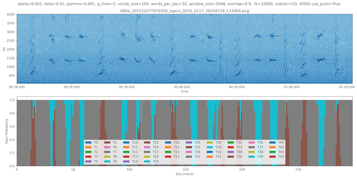

# 🎵 STM: Sound Topic Modeling
Largely based on the excellent work in [hb-song-analysis](https://github.com/tbergama/hb-song-analysis)

##  Getting Up and Running

🐳 Option 1: ROST via Docker (Recommended)

Build the Docker image from the project root:

```shell
docker build -t rost-cli -f DockerfileROST .
```

Then run the container to test with the `topics.refine.t` command:

```shell
docker run -it --rm rost-cli topics.refine.t --help
```

You should see the help message for the `topics.refine.t` command, which indicates that the ROST CLI is working correctly.
```text
(venv) docker run -it --rm rost-cli topics.refine.t --help                                                                                                                                                                                                                 (stm) 12:35:46
Topic modeling of data with 1 dimensional structure.:
  --help                                help
  -i [ --in.words ] arg (=/dev/stdin)   Word frequency count file. Each line is
                                        a document/cell, with integer 
                                        representation of words. 
  --in.words.delim arg (=,)             delimiter used to seperate words.
  --out.topics arg (=topics.csv)        Output topics file
  --out.topics.ml arg (=topics.maxlikelihood.csv)
                                        Output maximum likelihood topics file
  --out.topicmodel arg (=topicmodel.csv)
                                        Output topic model file
  --in.topicmodel arg                   Input topic model file
  --in.topics arg                       Initial topic labels

```

#### Option 2: ROST Local
Clone the [repository](https://gitlab.com/warplab/rost-cli) 

```shell
git clone https://gitlab.com/warplab/rost-cli
```

and follow the installation instructions found in their README.

Once ROST is installed, change the `rost_path` variable in conf.py to be the path to /rost-cli/bin/ directory
on your machine.

### Installing Python Dependencies

Install with the package manager your prefer.

With conda,
```shell
conda env create
```
With virtualenv, `pip install virtualenv` then
```angular2html
virtualenv --python=python3.6 venv
source venv/bin/activate
(venv) $ pip install -r requirements.txt
```
### Running the Project
Once all dependencies are installed, the project can be run with `(venv) $ ./run_model.sh`, which will run all
project modules using the parameters specified in conf.py. 
Modules can be run individually with `(venv) $ python module_name.py`. For example, the stft module
can be run individually with `(venv) $ python stft.py`. You may want to run the modules
individually to test different parameters of that module without rerunning the previous modules.  
A successful run will produce a plot similar to the following:

On top is a spectrogram of a ~50-second segment of the target file specified in conf.py. On bottom
is a stacked bar plot of topic probabilities over documents, where documents represent small increments
of time.

#### Quick Notes
* If the modules are run individually, they should be run in the order that they are run in run_model.sh.
each is dependent on the output of the last.
* If visualize.py raises an error saying that Python was not installed as a framework, try the 
solution [here](https://stackoverflow.com/questions/29433824/unable-to-import-matplotlib-pyplot-as-plt-in-virtualenv)

## References
* ROST: https://gitlab.com/warplab/rost-cli
